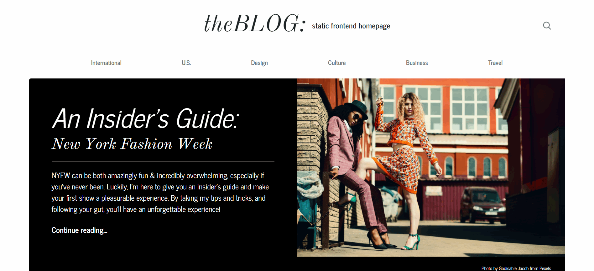

# Fashion Blog Frontend

**Premise**
Your friend Isa is a budding fashion blogger, and she’s asked you to build her a new website, just in time for New York Fashion Week!

Use your new HTML knowledge to create the underlying structure of the blog homepage. Make sure to include plenty of pictures, links, lists, and other HTML elements that you’ve learned so that her fans have plenty to read.

**Markup Language**
HTML, CSS

[View the Homepage !](https://oigwe.github.io/fashionBlog_frontend_homepage)
---

